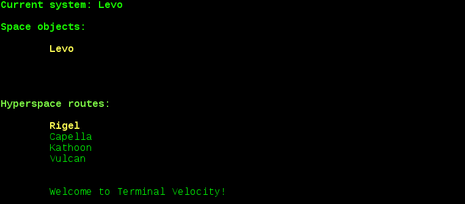
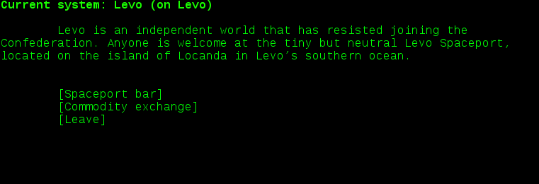

# Terminal Velocity

## What is it?

A text adventure port of [Escape Velocity](http://www.ambrosiasw.com/games/ev/).

This was written to play and practice with Perl. Idiosyncrasies, inconsistencies, and silliness abound. 

## Requirements
 - libcurses-perl
 - libwww-curl-perl

## Usage
```
./ev.pl [SCENARIO] (available scenarios: ev, evn, evo, fh)
```

Commands are entered as single characters. '?' for help.

## Screenshots




## Security note
 - Nova control bits are evaluated using the Safe module's "restricted eval" - nevertheless, don't run terminal velocity with untrusted scenario data.
 - Path traversal via scenario data is also a possibility (Contexter.pm).

## Copyright note
This repository does not include any scenario data; that is fetched from https://github.com/adamreiser/evnova-utils (a fork of https://github.com/vasi/evnova-utils) at runtime.
